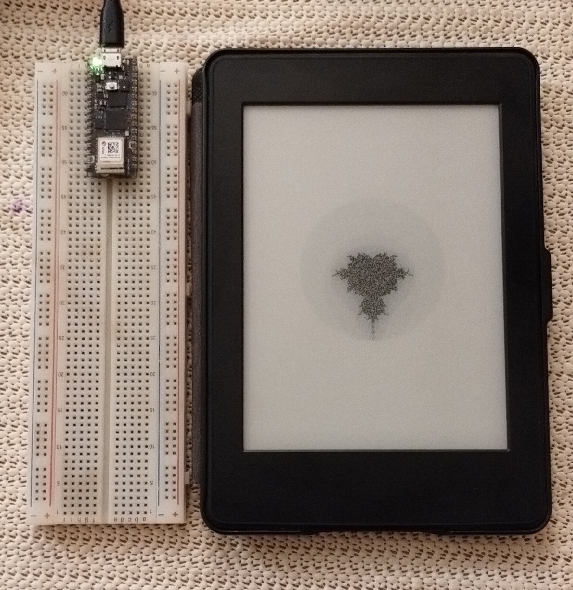

# Showpiece Display with a Kindle

This project turns a jailbroken Kindle into a simple, low-power showpiece display that regularly pulls images computed on an Arduino over WiFi.

## How to Run
There are two components to this project, the [Display Script](./showpiece_display.sh), and the [Server](./arduino_server/). You can use each component independently, and swap them for different implementations if needed.

The server is written for an [Arduino Nano RP2040 Connect](https://docs.arduino.cc/hardware/nano-rp2040-connect/), and will require changes for other microcontrollers. Open the folder in the Arduino IDE, edit `arduino_secrets.h` to set your WiFi credentials, and flash it onto your board. The board will connect to the network and print out the URL you need to use over Serial.

To use the Display Script, you need a jailbroken Kindle. In my case I have a Kindle Paperwhite PW3 with [WinterBreak](https://github.com/KindleModding/WinterBreak/). The script is designed to run as a [Scriptlet](https://kindlemodding.org/kindle-dev/scriptlets.html): putting it in the `documents` folder of your Kindle (`/mnt/us/documents` from inside) will make it visible as a book called "Showpiece Display" that you can open to launch it. Make sure to edit the script to set the URL you got from the Arduino beforehand.

## More Info
Write-up about this project coming (hopefully) soon!
